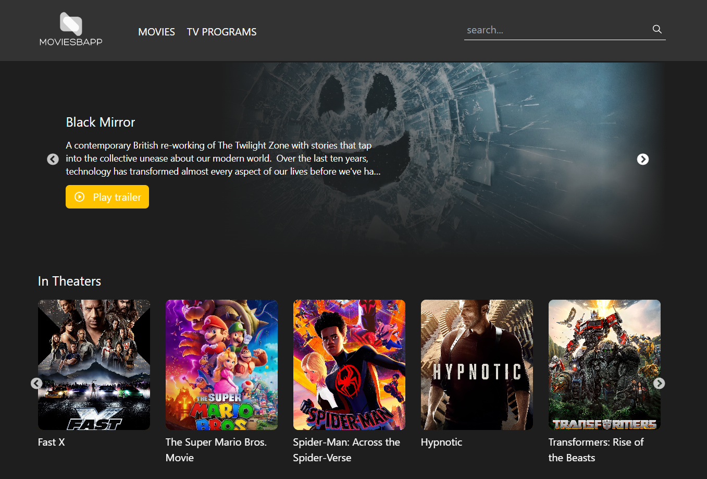
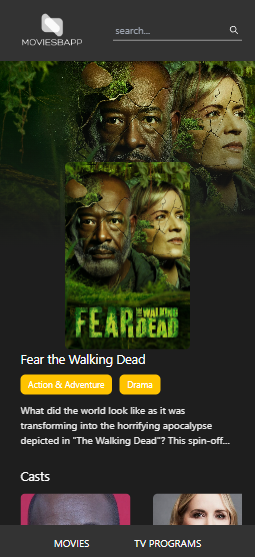

## MOVIESBAPP

Este proyecto es una aplicación web para buscar y descubrir películas y programas de televisión. Proporciona una interfaz de usuario intuitiva para explorar contenido, realizar búsquedas y obtener detalles sobre películas, programas de televisión, actores, temporadas y más.

## Guía de inicio rápido

Sigue estos pasos para configurar y ejecutar el proyecto en tu entorno local.

### Requisitos previos

Asegúrate de tener instalado lo siguiente en tu sistema:

- Node.js
- Yarn

### Pasos de instalación

1. Clona el repositorio de GitHub:

   ```shell
   git clone https://github.com/Serblaor/MovieSBapp

Ve al directorio del proyecto:
cd moviesbapp

### Instala las dependencias utilizando Yarn:
yarn install


### Inicia la aplicación:
yarn start
Abre tu navegador web y accede a http://localhost:3000 para ver la aplicación en funcionamiento.

### API expuestas
El proyecto utiliza la API de TMDB (The Movie Database) para obtener información sobre películas, programas de televisión, actores y más. Puedes obtener una clave de API gratuita registrándote en el sitio web de TMDB y siguiendo sus instrucciones para obtener una clave de API.

### Razones para usar MOVIESBAPP
Interfaz intuitiva y fácil de usar.
Amplia base de datos de películas y programas de televisión.
Búsqueda rápida y precisa de contenido.
Información detallada sobre películas, actores, temporadas, etc.
Diseño responsive para adaptarse a diferentes dispositivos.

### Uso
Aquí hay algunas características destacadas de MOVIESBAPP:

Búsqueda avanzada de películas y programas de televisión.
Información detallada de películas y programas de televisión, incluyendo sinopsis, reparto, temporadas, géneros, etc.
Visualización de trailers y avances de películas.
Exploración de películas y programas de televisión por género.
Interfaz amigable para dispositivos móviles.


<div align="center">
  
</div>

<div align="center">
  
</div>